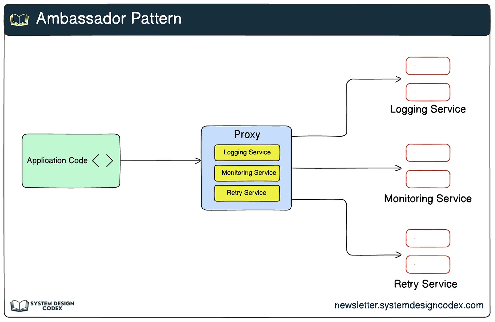
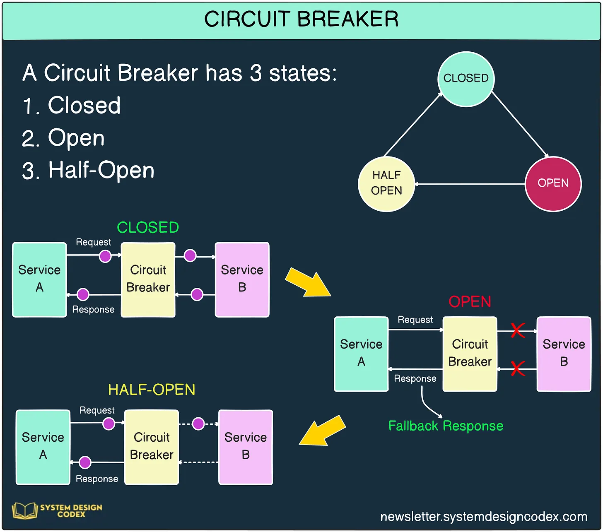
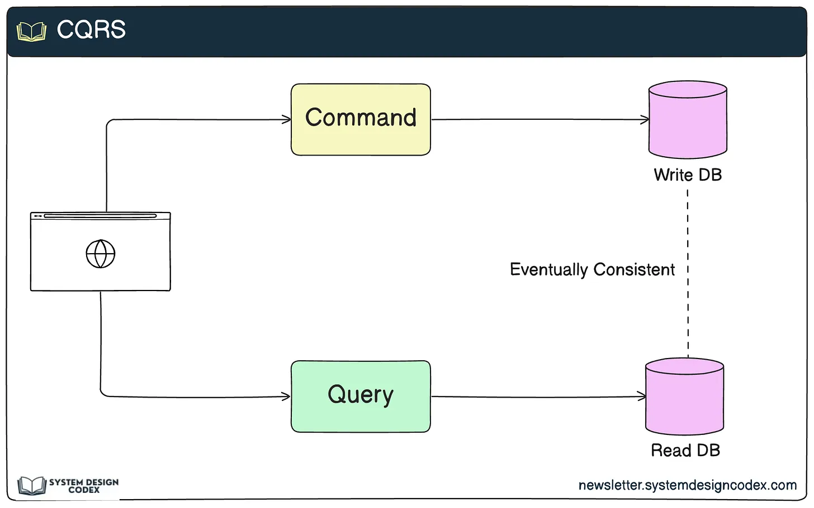
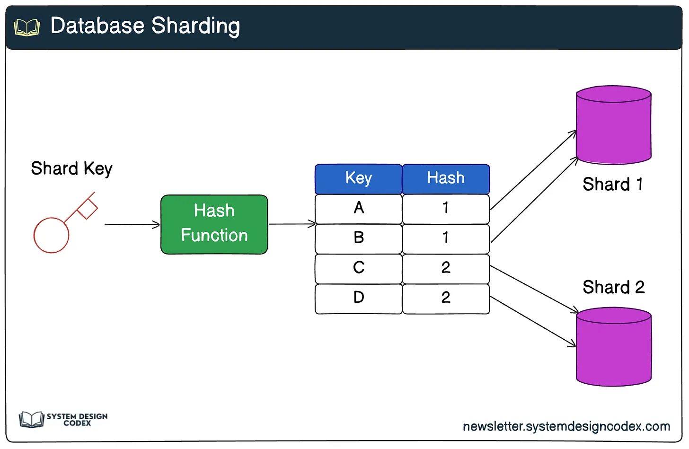
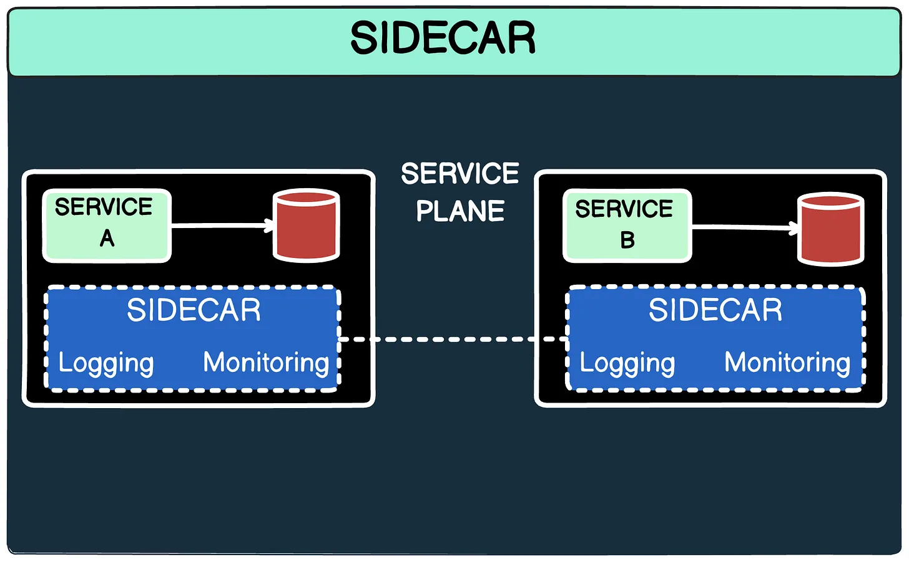
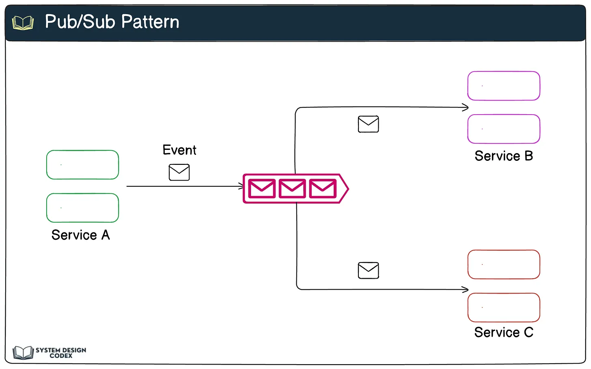
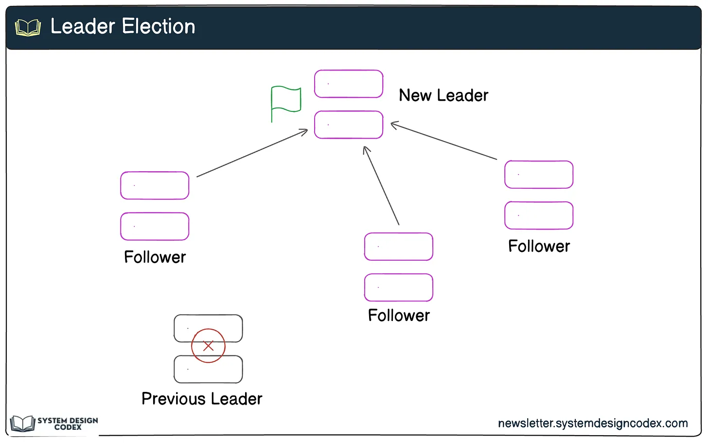
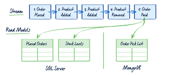

**How It Works:**
The ambassador acts as a proxy between the application and external services or infrastructure components.

It manages tasks that are orthogonal to the core business logic, ensuring that the main service remains lightweight.

**Benefits:**
Simplifies the main application by removing repetitive tasks.

Improves observability with centralized logging and monitoring.

Enhances resiliency with features like automatic retries and circuit breaking.

**Use Case:**
In microservices architectures, an ambassador service can handle retries and timeouts when calling external APIs, ensuring the main service isn’t bogged down by such concerns.

**How It Works:**
When a service call fails repeatedly, the circuit breaker transitions to an open state, rejecting further requests.

After a cooldown period, it transitions to a half-open state to test if the service has recovered.

If successful, the circuit closes; otherwise, it remains open.

**Benefits:**
Protects services from overwhelming downstream dependencies.

Improves system stability by isolating failing components.

Enables faster recovery by reducing unnecessary traffic to struggling services.

**Use Case:**
An e-commerce platform can use a circuit breaker to prevent the order processing service from repeatedly calling an unresponsive payment gateway, preserving system resources.

**How It Works:**
The command model handles writes (e.g., creating or updating data).

The query model handles reads, often using precomputed, denormalized views for efficient querying.

**Benefits:**
Improves scalability by separating workloads for reads and writes.

Enables different data models and technologies for each operation.

Simplifies complex business logic by focusing on one responsibility per model.

**Use Case:**
An online store can use CQRS to handle high-volume read operations (product catalog browsing) separately from write operations (order placement).

**How It Works:**
Data is partitioned based on a key (e.g., user ID or geographical region).

Each shard operates independently, handling its own subset of data.

**Benefits:**
Improves horizontal scalability by distributing workload across multiple servers.

Reduces single-point failures, as the failure of one shard doesn’t affect others.

Enhances performance by minimizing contention for resources.

**Use Case:**
A social media platform can shard user data by region, ensuring that localized traffic spikes don’t overwhelm the entire database.

**How It Works:**
The main service and its sidecar container share the same host or pod (in Kubernetes).

The sidecar interacts with the main service through local communication mechanisms, such as shared memory or a local network.

**Benefits:**
Decouples auxiliary tasks from the main service, simplifying its development.

Enables consistent implementation of shared concerns across multiple services.

Facilitates microservices deployments by bundling related functionality.

**Use Case:**
A sidecar container can handle log aggregation for a microservice, sending logs to a centralized monitoring platform without impacting the service itself.

**How It Works:**
Publishers send messages to a topic or event stream.

Subscribers listen to the topic and process messages as they arrive.

A message broker (e.g., Kafka, RabbitMQ) manages the topics and ensures delivery.

**Benefits:**
Decouples producers and consumers, allowing independent scaling.

Supports real-time data streaming and event-driven architectures.

Enables multiple consumers to process the same event for different purposes.

**Use Case:**
An IoT platform can use Pub/Sub to collect data from sensors (publishers) and process it in real time using analytics services (subscribers).

**How It Works:**
Nodes in the system participate in a leader election process, often using consensus algorithms like Raft or Paxos.

Once elected, the leader coordinates tasks until it fails or resigns.

**Benefits:**
Prevents conflicts by ensuring a single source of truth.

Simplifies task coordination in distributed environments.

Enables fault tolerance by re-electing a new leader in case of failure.

**Use Case:**
A distributed database can use leader election to manage write operations, ensuring consistency across replicas.

**How It Works:**
Each state change (event) is appended to an event store.

Consumers (e.g., query models) use these events to build views or perform analytics.

**Benefits:**
Provides a complete audit log of all state changes.

Supports replaying events for debugging or rebuilding state.

Simplifies implementation of CQRS, as the event store can feed the query model.

**Use Case:**
A financial application can use event sourcing to track every transaction, ensuring a reliable audit trail for compliance and reconciliation.